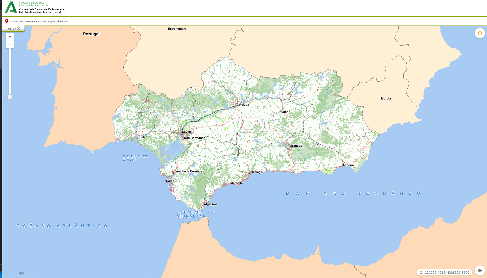

# MapFooter

[](https://github.com/sigcorporativo-ja/Mapea4-dev-webpack)

## Descripción

 Plugin de [Mapea](https://github.com/sigcorporativo-ja/Mapea4) para la generación automática de cabecera de pagina. 



Para el correcto funcionamiento del plugin es necesario pasarle en su constructor un objeto **json** con los parámetros esperados.
### Parámetros del plugin

```javascript
const configIECA = {
  open: true,
  htmlCode: '<div id="cabecera"> <div id="cabecera_1"> <div id="logos"><a href="https://www.juntadeandalucia.es"></a><a href="https://www.juntadeandalucia.es/institutodeestadisticaycartografia/" accesskey="h"></a> </div></div></div><div id="navigation"> <div class="lineacolor fondocolor1"> &nbsp;</div><div id="menu_horizontal"> <div id="menu_horizontal_1"> <div id="caminomigas">Est&aacute; en: <a href="https://www.juntadeandalucia.es/institutodeestadisticaycartografia/">Inicio</a> - <a href="https://www.juntadeandalucia.es/institutodeestadisticaycartografia/temas/index-geo.htm">Georreferenciaci&oacute;n</a> - <a href="https://www.juntadeandalucia.es/institutodeestadisticaycartografia/index.htm">P&aacute;gina del producto</a> </div></div><div id="menu_horizontal_2"> <div id="botoneramenu"></div></div></div></div>',
  cssList: [
    'https://www.juntadeandalucia.es/institutodeestadisticaycartografia/portal/css/estiloCabecera2015.css',
    'https://www.juntadeandalucia.es/institutodeestadisticaycartografia/portal/css/estiloGenerico.css',
    'https://www.juntadeandalucia.es/institutodeestadisticaycartografia/portal/css/estiloVisor.css',
  ]
}
```

- **open [boolean]:**  Parámetro que inicializa el plugin con el pie de página abierto o cerrado.
- **htmlCode [string]:** codigo html a partir del cual se construye el pié de página
- **cssList [array]:**  Listado de archivos css que se inyectan en el visor para su uso en el pie de página


## Recursos y configuración

- js: mapheader.ol.min.js
- css: mapheader.min.css

```javascript

const configIECA = {
  open: true,
  htmlCode: '<div id="cabecera"> <div id="cabecera_1"> <div id="logos"><a href="https://www.juntadeandalucia.es"></a><a href="https://www.juntadeandalucia.es/institutodeestadisticaycartografia/" accesskey="h"></a> </div></div></div><div id="navigation"> <div class="lineacolor fondocolor1"> &nbsp;</div><div id="menu_horizontal"> <div id="menu_horizontal_1"> <div id="caminomigas">Est&aacute; en: <a href="https://www.juntadeandalucia.es/institutodeestadisticaycartografia/">Inicio</a> - <a href="https://www.juntadeandalucia.es/institutodeestadisticaycartografia/temas/index-geo.htm">Georreferenciaci&oacute;n</a> - <a href="https://www.juntadeandalucia.es/institutodeestadisticaycartografia/index.htm">P&aacute;gina del producto</a> </div></div><div id="menu_horizontal_2"> <div id="botoneramenu"></div></div></div></div>',
  cssList: [
    'https://www.juntadeandalucia.es/institutodeestadisticaycartografia/portal/css/estiloCabecera2015.css',
    'https://www.juntadeandalucia.es/institutodeestadisticaycartografia/portal/css/estiloGenerico.css',
    'https://www.juntadeandalucia.es/institutodeestadisticaycartografia/portal/css/estiloVisor.css',
  ]
}

const mp = new Mapheader(configIECA);
map.addPlugin(mp);
```
## Visor Demo
Para comprobar el funcionamiento de este plugin se puede acceder al siguiente enlace [Ejemplo Visor](https://emiliopardo.github.io/mapheader/).

## Video Demo

Para comprobar el funcionamiento de este plugin se puede descargar el [Video](https://github.com/emiliopardo/mapfooter/blob/master/docs/video/mapHeader.webm?raw=true) el cual contempla la configuración y carga del plugin con diferentes cabeceras de páginas